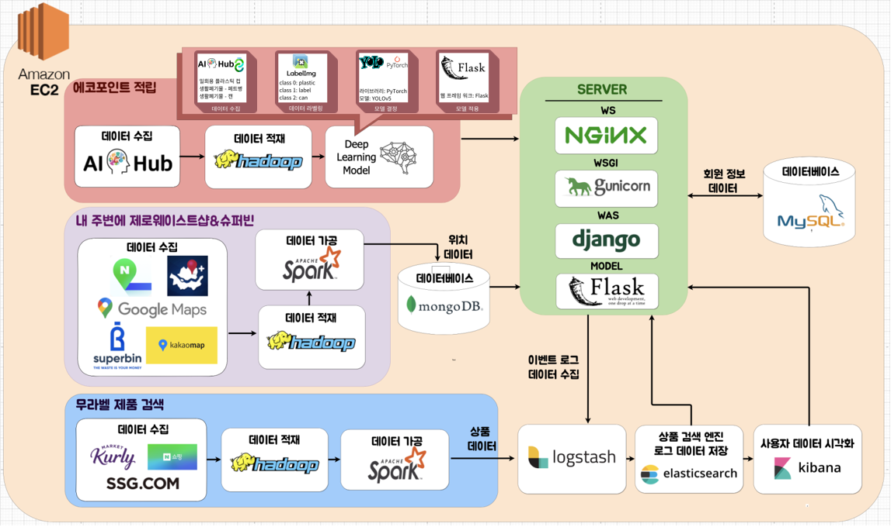
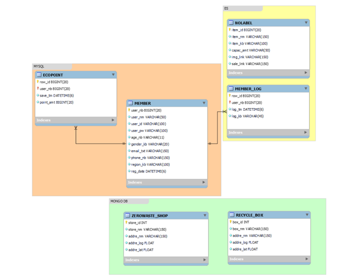
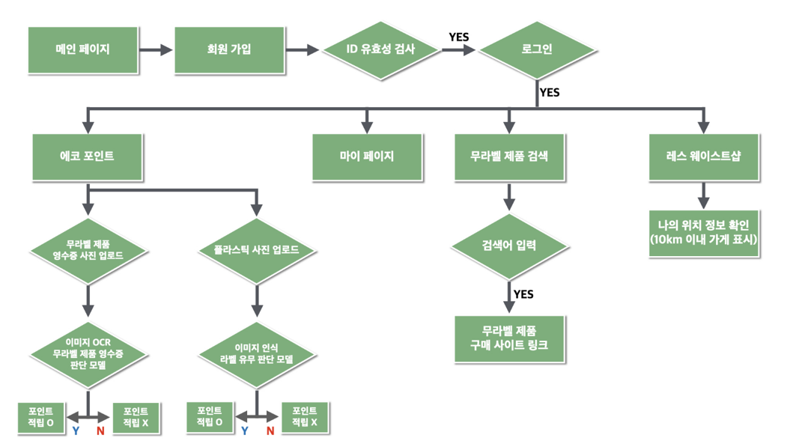
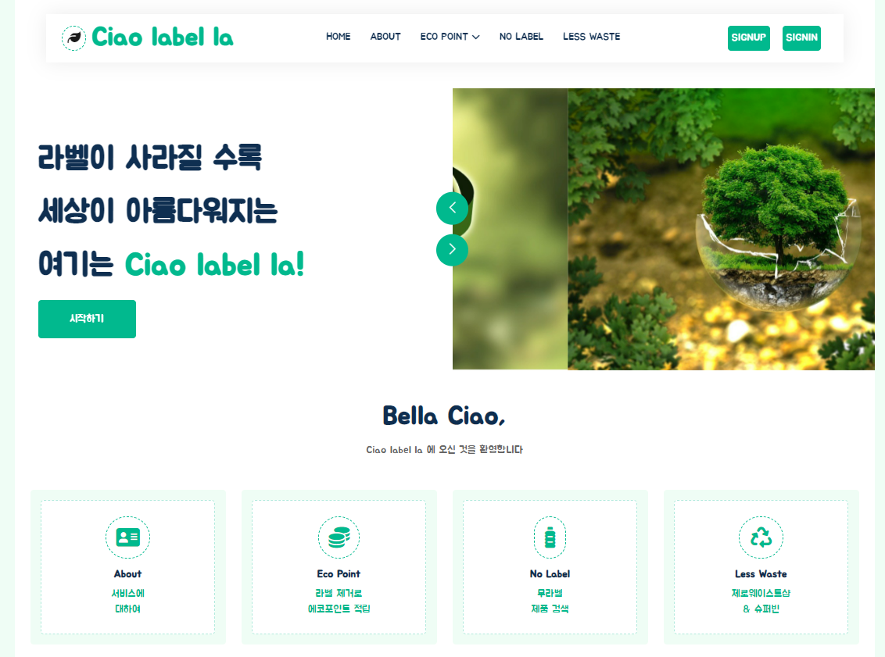
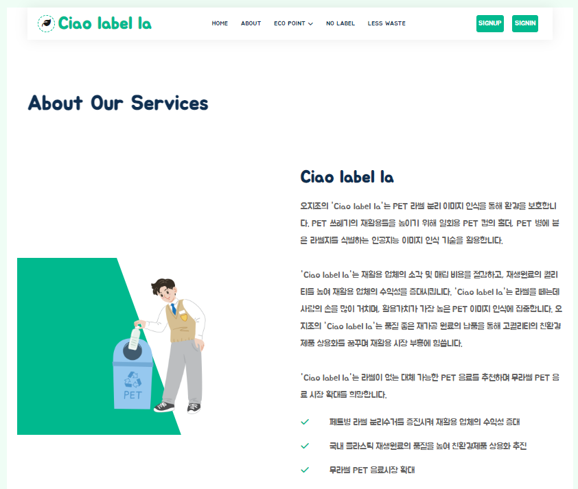
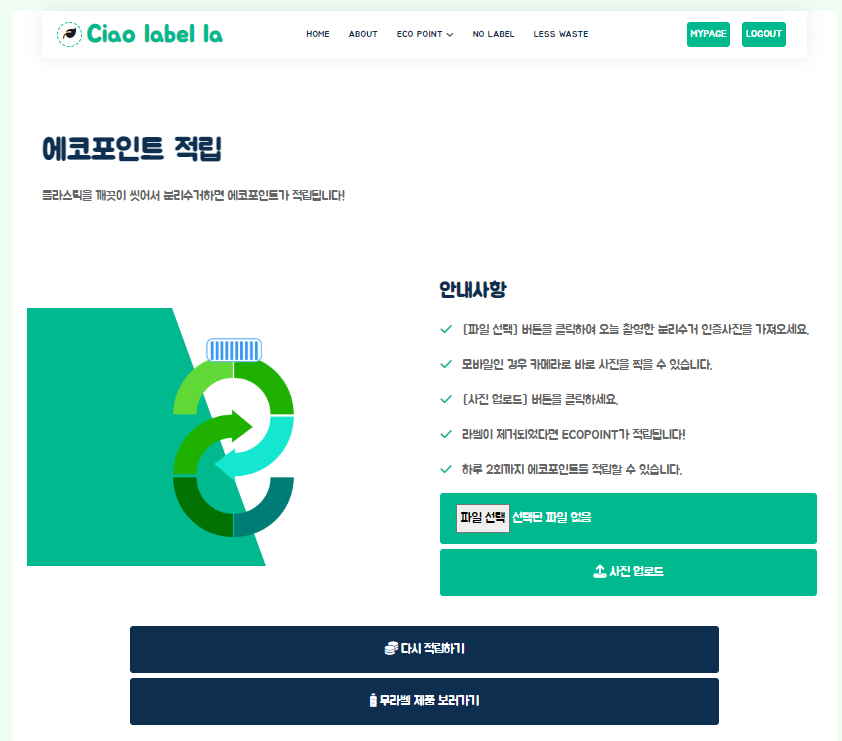
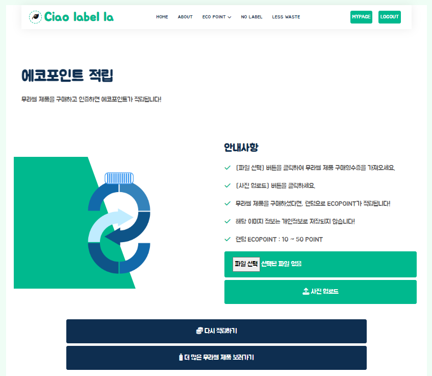
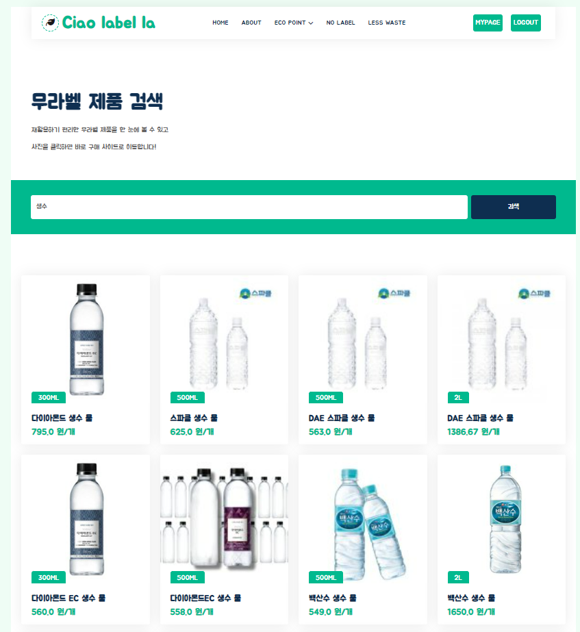
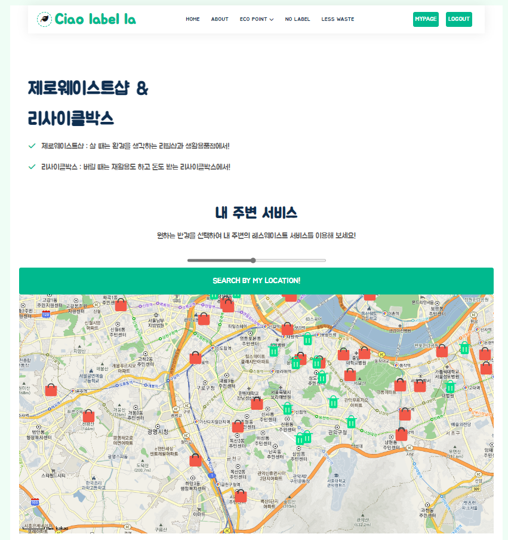
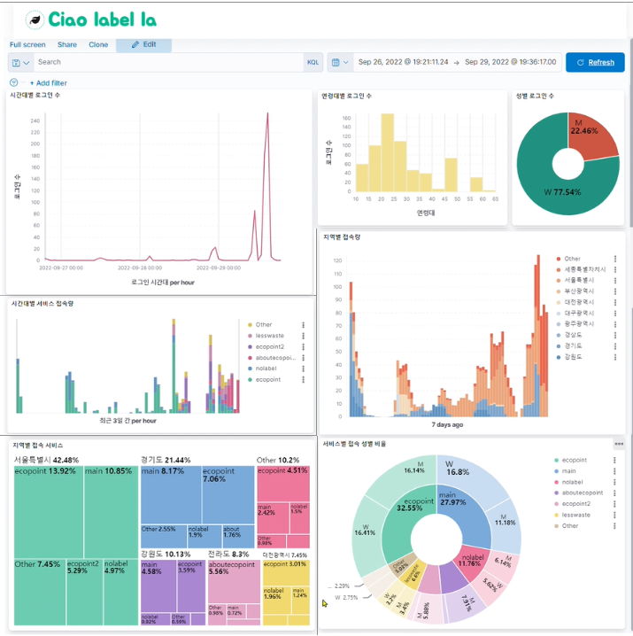

# PJT_Ciaolabella1
플라스틱 라벨 여부 이미지 인식에 따른 에코 포인트 적립 서비스
- 기업요구사항 기반의 문제해결 프로젝트 우수상 수상 (멀티캠퍼스)

---

## 1. 프로젝트 개요

- 프로젝트 기간 : 2022.08.18 ~ 2022.09.30

  - Team Ohjijo

    - 데이터 엔지니어 : **주한나**, 고유정, 신부용

    - 데이터 사이언티스트 : **안소연**, 신기은, 인창환

- 프로젝트 배경

  - 2022년 약 71조원, 연평균 성장률 6.4% 재생 플라스틱 시장.
    - 재생 플라스틱 : 사용된 플라스틱을 기반으로 물리적, 화학적, 열적의 방법을 이용하여 옷, 연료, 에너지 등을 얻을 수 있어 비용 절감이 가능함.
  - 한국 : 2021년 기준 1인당 플라스틱 사용량이 세계 3위.
    - 인구 및 국토 면적과 비교시 플라스틱 사용 높으나 재활용률이 낮고 되려 폐플라스틱을 수입했었음.
  - 재활용 산업은 인건비가 높은 산업으로 수익이 낮아지고 있는 상황.
    - 국내 재활용 업체는 80%가 민간업체로 운영되고 있으며, 무분별한 불법투기로 인해 제대로 처리되지 않은 쓰레기들이 넘쳐나고 있음.
    - 재활용 업체로 들어오는 쓰레기들이 올바르게 분리수거가 이루어지지 않아 인건비는 지속적으로 상승함.
  - 재활용이 가능할수록 친환경적이고 수익이 높아지지만, 재활용이 불가능할 수 록 소각 매립 비용이 발생하여 지출이 확대되고 환경이 파괴되는 악순환이 발생됨.
  - 자원 재활용률을 높이기 위해 "플라스틱의 라벨을 제거하여 올바르게 분리수거하기" 초점을 맞춤.

- 프로젝트 주제 
  - 플라스틱 라벨 여부 이미지 인식에 따른 에코포인트 적립 서비스
    - 라벨이 없는 제품 OCR인식에 따른 에코포인트 적립 서비스
  - 친환경 제품 및 상점 위치 조회 서비스
    - 라벨이 없는 제품(Nolabel) 제품 안내
    - 리사이클 박스 "네프론"과 전국의 "레스웨이스트샵" 위치 안내 

## 2. 프로젝트 설계

### 2.1. 파이프 라인 설계

### 2.2. 데이터 ERD & 명세서

**< 데이터 ERD>**

**< 데이터 명세서>**

### 2.3. 서비스 플로우

## 3. 프로젝트 구현

**<메인 페이지>**

**<About 페이지>**

**<Ecopoint1 페이지>**

- 플라스틱의 라벨을 제거한 후 인증 성공시 에코 포인트 적립**(AI 모델 적용)**

**<Ecopoint2 페이지>**

**<No Label 제품 검색 페이지>**

- 검색 엔진을 위해 Elasticsearch을 이용함. 
  - 인덱스를 통한 빠른 검색 가능.

**<Less Waste 페이지>**

- 사용자 위치 정보를 기반으로 주변의 레스웨이스트샵 위치 조회.
  - MongoDB를 사용하여 사용자 기준 위치 데이터 필터링

**<회원 페이지>**

- Ecopoint 서비스를 이용하여 적립한 에코 포인트에 따른 에코레벨 부여
- 에코 포인트 적립 현황 조회

- 회원가입 및 로그인 페이지

  

  

  

**<관리자 페이지>**

- 실시간으로 사용자 로그 데이터를 수집하여 ELK을 통한 시각화.

